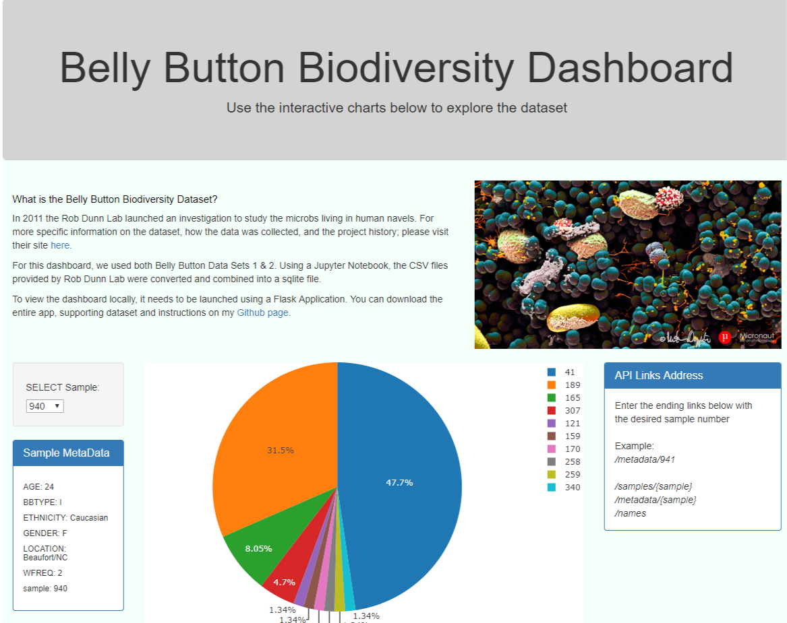

# Belly Button Biodiversity

## Objective

Build an interactive dashboard to explore the Belly Button Biodiversity DataSet

Follow this link to to view the dashboard live on Heroku: https://nesbit-bellybutton-dashboard.herokuapp.com/

## About the Data
The Belly Button Biodiversity Dataset was created in 2011 as part of an investigation looking at the microbes inhabiting our navels.
If you want to learn more about the actual study and where the dataset came from, visit: http://robdunnlab.com/projects/belly-button-biodiversity/

## Project Goals:
* Create interative dashboard to explore and visualize the data
* Create Flask-API for alternative method to access the data

